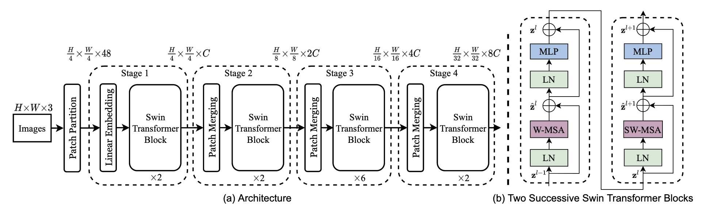

## Brazen Score

Brazen Score transcribes images of scores to structured format using neural networks.

### Overview
The initial implementation is based on a subset of sheet music, [the Primus dataset](https://grfia.dlsi.ua.es/primus/) (printed images of music staves) that contains ~87000 short incipits (note sequeneces which can be used to identify melodies) in an image format as well as in MEI and two different custom encoding sequences. Ultimately the plan is to support [ABC notation](https://en.wikipedia.org/wiki/ABC_notation) which is a straightforward encoding, or even lilypond.

### Usage

Feed in an image, it will predict the encoding. The encoding is captured for now as 

### Design 

The neural network consists of:

1) A SWIN Transformer visual transformer 
2) Inject sequence embeddings
3) Transformer self-attention to sequence



### Future

Abjad could be used in the future to generate arbitrary amounts of data to train the transformer. This would then potentially be transferred to "real world" dataset of ABC files and ultimately to a more complex Lilypond format, although that is quite a ways off

### Serving

Build
```bash
docker build -t brazen-score .
```

Serve
```bash
docker run -t -d --rm -p 8080:8080 -p 8081:8081 --name=brazen-score brazen-score:latest
```

Query
```bash
curl -X POST -H --silent --data-urlencode "data=\"X: 1\nM: 4/4\nL: 1/4\nK: C clef=treble\n| C D E F | G A B A | G F E D | C\"" http://localhost:8080/predictions/brazen-score
```

For dependencies check https://pytorch.org/serve/use_cases.html#serve-custom-models-with-third-party-dependency
